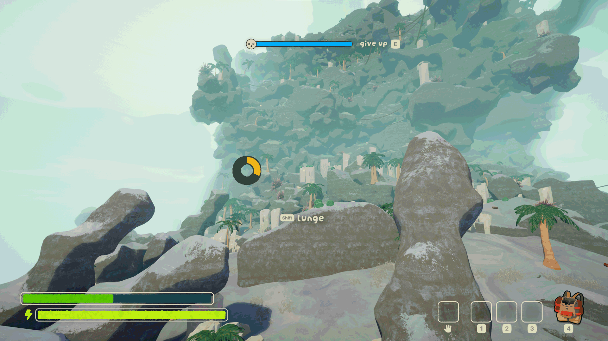

# Reconnect Fix
If you've encountered the issue pictured below when reconnecting to a game, this is the mod for you!

## What Causes This
During reconnection, an error will sometimes prevent the player's character from spawning. This mod simply creates the player character in this case.

## Notes
This mod is client-side so this will only apply a fix for you.

## Credits
Special thanks to Tobenai, Pleiades and Chameleon for helping me test this mod.